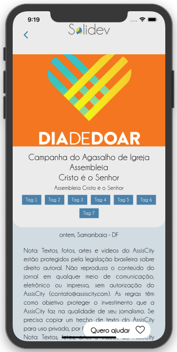

<div align="center">
  
  <br />
  
</div>

<p align="center">
    
</p>
<p align="center">
  <a href="#rodando-o-projeto-localmente">Rodando o projeto localmente</a>&nbsp;&nbsp;&nbsp;|&nbsp;&nbsp;&nbsp;
  <a href="#tecnologias-utilizadas">Tecnologias</a>&nbsp;&nbsp;&nbsp;|&nbsp;&nbsp;&nbsp;
  <a href="#autores">Autores</a>
</p>

<div align="center">
  
</div>

<div align="center">
<div>


</div>

<div>


</div>
</div>
<p align="center">Para mais exemplos, acesse a pasta demo.</p>

O Solidev é um aplicativo que foi desenvolvido durante o Hackathon UnB-FGA 2020.

O Hackathon UnB-FGA 2020 teve como objetivo estimular os estudantes da
Universidade de Brasília e colaboradores a desenvolver ferramentas que pudessem suprir
necessidades criadas pela COVID-19, tendo como público alvo a população do Distrito
Federal.

Diante do cenário de proliferação da COVID-19, juntamente com a necessidade de isolamento
social, muitas pessoas e famílias tiveram sua renda impactada. Da mesma forma, Entidades
Filantrópicas/Beneficentes tiveram uma queda abrupta em suas doações.

O Solidev surge como uma solução visando facilitar o relacionamento entre
doadores e beneficiários, assim como a realização de doações, implementando funcionalidades
que viabilizam a comunicação entre doadores e entidades beneficentes, ações solidárias como,
por exemplo, buscar uma doação que uma entidade não pode buscar e doações de alimentos da agricultura
familiar.

## Rodando o projeto localmente

### Pré requisitos

Para executar o software localmente, são necessárias as seguintes ferramentas:

<li>
<a href="https://expo.io/tools#cli">expo</a>
</li>
<li>
  <a href="https://yarnpkg.com/getting-started/install#global-install">yarn</a>
</li>

### Instação

### 1 - Baixe o repositório

```bash
git clone https://github.com/Hackathon-FGA-2020/Desafio-2-Grupo-2
```

### 2 - Entre na pasta do projeto

```
cd Desafio-2-Grupo-2
```

### 3 - Instale as dependências

```
cd backend
yarn
```

```
cd mobile
yarn
```

### 4 -Configurar o ambiente do backend

Configuração das variáveis de ambiente do banco de dados:

```
DB_HOST=localhost
DB_USER={ USUÁRIO DO BANCO DE DADOS}
DB_PASS={ SENHA DO BANCO DE DADOS}
DB_NAME={ NOME DO BANCO DE DADOS}
```

### 5 -Configurar o ambiente do mobile

Configuração do arquivo mobile/src/config/ipconfig.js
O ip é igual ao do expo porém sem a porta
Ex.: 192.168.0.XX

```
ip: ''
```

### 6 - Execute o backend

```
cd backend
yarn run dev
```

### 7 - Execute o mobile

```
cd mobile
yarn start
```

## Tecnologias utilizadas

- [Express](https://expressjs.com/) - Framework utilizado no backend
- [Sequelize](https://sequelize.org/) - ORM para consular o banco de dados postgres
- [React Native](https://reactnative.dev/) - Framework utilizado no frontent
- [Styled components](https://styled-components.com/) - Estilização de componentes no react native
- [Docker](https://www.docker.com/) - Conteinerização do postgreSQL

## Autores

- [Israel Santos](https://github.com/israelcarlos01)
- [João Magalhães](https://github.com/joaovictornm)
- [Lucas Rosa]()
- [Matheus Alves](https://github.com/MSantosAlves)
- [Richard Viana](https://github.com/richardjlv)
- [Robson Melo](https://github.com/RobinhoRamon)
- [Vicente Moraes](https://github.com/PurpleBooth)

## Observações

A integração de algumas páginas ainda não foi feita por completa por conta do prazo disponível. Mesmo assim, conseguimos um ótimo resultado e estamos felizes
com tudo que aprendemos ao longo dessa semana.

## Licença

Esse projeto está sob licença GNU que pode ser encontrada <a href="https://github.com/Hackathon-FGA-2020/Desafio-2-Grupo-2/blob/master/LICENSE">aqui</a>.

## Link da apresentação (youtube)
https://www.youtube.com/watch?v=kTShqqh1QK8&feature=youtu.be
